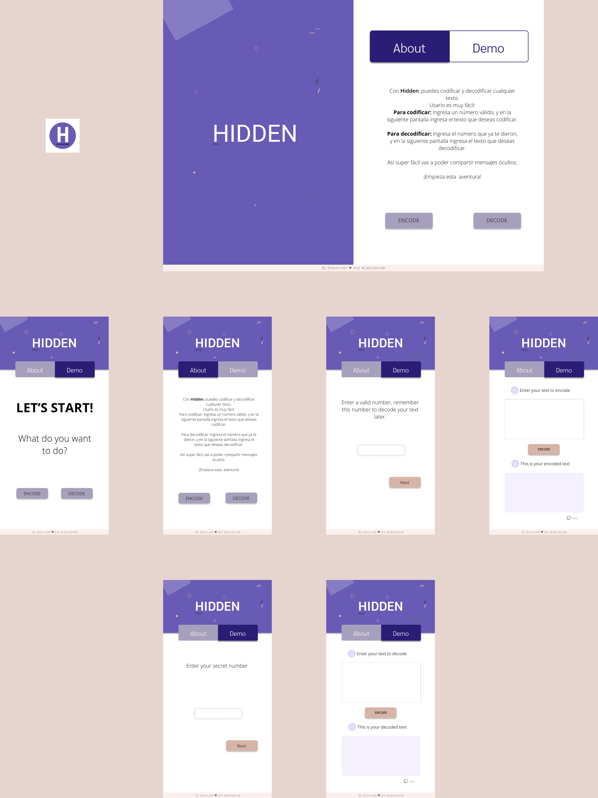

#  Cifrado César (HIDDEN)

## Índice

* [1. Instalación](#1-Instalación)
* [2. Resumen del proyecto](#2-resumen-del-proyecto)
* [3. Investigación UX](#3-investigación-UX)

***

## 1. Instalación
### Requisitos
* Node.js

### Clonar
*Clona este repositorio en tu computadora usando:*
```text
$ git clone https://github.com/SharonHQ/LIM013-cipher.git
```

### Configuraciones
*Para instalar npm*
```text
$ npm install
```

### Ejecutar 
*Ahora, iniciaremos un servidor local con la siguiente línea.*
```text
$ npm start
```
***
## 2. Resumen del proyecto
**Hidden** es una aplicación web que tiene como objetivo codificar y descodificar texto con la técnica de [*Cifrado César*](https://en.wikipedia.org/wiki/Caesar_cipher), que consiste en la sustitución de cada letra de un texto por otro, mediante un número de desplazamiento. En esta versión, solo se recibe como número de desplazamiento, números positivos y diferentes a un múltiplo de 26, y en textos a codificar y descodificar, estos se convierten en mayúsculas, exceptuan la letra ñ, caracteres y respeta los espacios en blanco.


## 3. Investigación UX
### i. Usuarios y los objetivos en relación con el producto
* Usuarios: Todas las personas que tengan la necesidad de codificar un texto.

* Objetivos: codificar y decoficar textos con un número (1-∞) postivo y diferente a un múltiplo de 26.

### ii. Cómo el producto soluciona los problemas/necesidades de dichos usuarios.
**Hidden** codifica y decodifica textos por el momento sin tildes, las convierte en mayúsculas, exceptua la letra ñ y caracteres, y respeta espacios en blanco.  

### iii. Prototipo en papel


### iv. Resumen del feedback recibido
Del protipo en papel, se tuvo que hacer diferentes mejoras, como por ejemplo:
* Diseñar algo más atractivo para el usuario.
* Darle un nombre a la aplicación web.
* Pedir número de desplazamiento(_offset_) en una pantalla diferente.
* Codificación y decoficación automática sin necesitad de un botón.
* Agregar iconos.
### v. Prototipo final.
Prototipo móvil en figma 
* [Diseño en figma](https://www.figma.com/file/9CQ4EY1vX7j3eqbJ04yfGU/Hidden?node-id=0%3A1)
* [Prototipo Móvil](https://www.figma.com/proto/9CQ4EY1vX7j3eqbJ04yfGU/Hidden?node-id=21%3A3&scaling=min-zoom)


